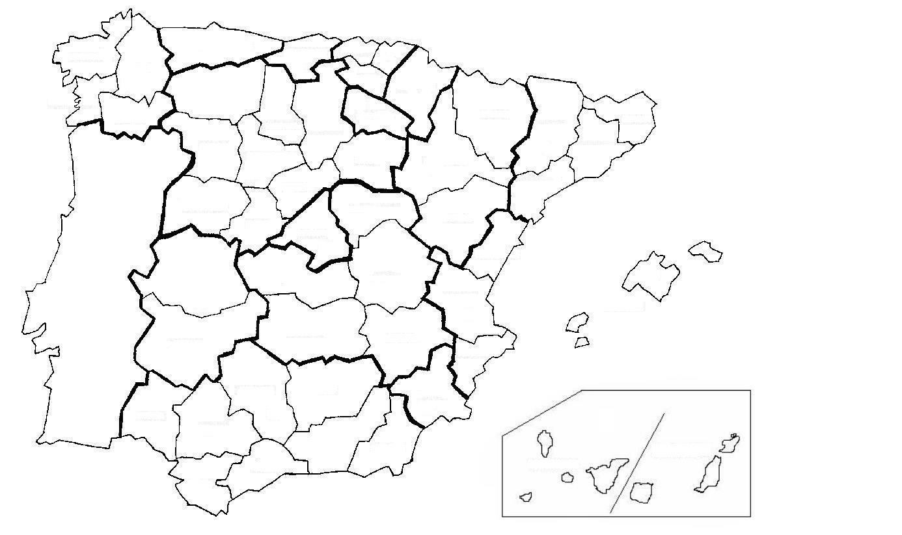

## Spanish Provinces Quiz

Do you know which are the 50 provinces of Spain? Quiz yourself with this game and see how far you go!

This project is part of the 100 Days of Code Challenge, and a good chance to learn:

1. Spanish Geography
2. Pandas library and working with csv files
3. The Turtle module in pyhton and GUI programming